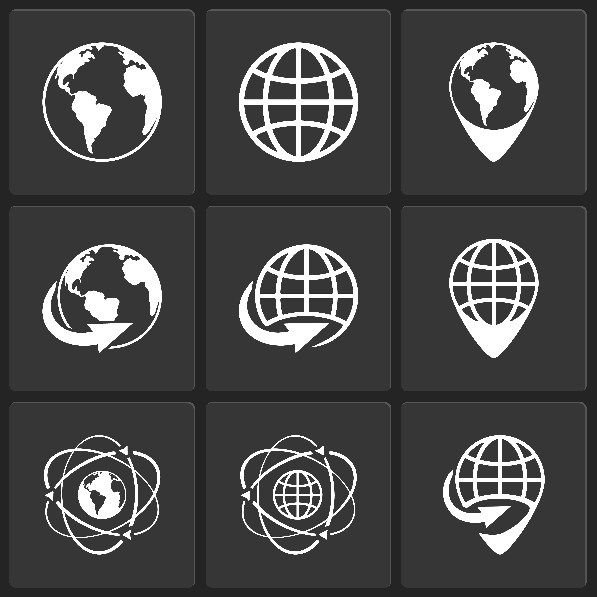

<!--

author:   name last_name
email:    training@vib.de
version:  1.0.0
language: en
narrator: UK English Female

icon:     https://vib.be/sites/vib.sites.vib.be/files/logo_VIB_noTagline.svg

comment:  This document shall provide an entire compendium and course on the
          development of Open-courSes with [LiaScript](https://LiaScript.github.io).
          As the language and the systems grows, also this document will be updated.
          Feel free to fork or copy it, translations are very welcome...

script:   https://cdn.jsdelivr.net/chartist.js/latest/chartist.min.js
          https://felixhao28.github.io/JSCPP/dist/JSCPP.es5.min.js

link:     https://cdn.jsdelivr.net/chartist.js/latest/chartist.min.css
link:     https://cdnjs.cloudflare.com/ajax/libs/animate.css/4.1.1/animate.min.css
link:     https://raw.githubusercontent.com/vibbits/material-liascript/master/img/org.css
link:     https://cdnjs.cloudflare.com/ajax/libs/font-awesome/5.11.2/css/all.min.css
link:     https://fonts.googleapis.com/css2?family=Saira+Condensed:wght@300&display=swap
link:     https://fonts.googleapis.com/css2?family=Open+Sans&display=swap
link:     https://raw.githubusercontent.com/vibbits/material-liascript/master/vib-styles.css

tutor: Neuropixels
edition: 1st 

-->

# Course Title

Hello and welcome to our @tutor workshop! We are very happy to have you here.

This is the @edition edition of this workshop, jointly organised by the VIB and ELIXIR Belgium.

Example image to ilustrate the front page of the material. This image was [Designed by macrovector / Freepik](https://www.freepik.com/free-vector/globe-earth-world-icons-vector-white-black_10601425.htm#fromView=author&page=1&position=27&uuid=726a85e1-abc9-4f55-a242-bdb7cd5733f1)

> We are using the interactive Open Educational Resource online/offline course infrastructure called LiaScript.
> It is a distributed way of creating and sharing educational content hosted on github.
> To see this document as an interactive LiaScript rendered version, click on the
> following link/badge:
>
> [

## Lesson overview
<section>

<i class="fa fa-lock"></i> **License:** [Creative Commons Attribution share alike 4.0 International  License](https://creativecommons.org/licenses/by-sa/4.0/deed.en)

## General context

Welcome to our {{workshop_name}} workshop! We are very happy to have you here.

This is the {{workshop_edition}} edition of this workshop, jointly organised by the VIB Bioinformatics Core and ELIXIR Belgium.

- The first session (12 & 13 October 2023) is dedicated to Containers (Docker & Singularity) which are great tools for code portability and reproducibility of your analysis. You will learn how to use containers and how to build a container from scratch, share it with others and how to re-use and modify existing containers.

The **presentation** which goes alongside this material can be found [here](link).

>
> <i class="fa fa-user"></i> **Target Audience:** Researchers, trainers, training providers
>
>> <svg xmlns="http://www.w3.org/2000/svg" height="14" width="16" viewBox="0 0 576 512"><!--!Font Awesome Free 6.5.1 by @fontawesome - https://fontawesome.com License - https://fontawesome.com/license/free Copyright 2023 Fonticons, Inc.--><path d="M384 64c0-17.7 14.3-32 32-32H544c17.7 0 32 14.3 32 32s-14.3 32-32 32H448v96c0 17.7-14.3 32-32 32H320v96c0 17.7-14.3 32-32 32H192v96c0 17.7-14.3 32-32 32H32c-17.7 0-32-14.3-32-32s14.3-32 32-32h96V320c0-17.7 14.3-32 32-32h96V192c0-17.7 14.3-32 32-32h96V64z"/></svg> **Level:** Beginner  
>

<i class="fa fa-arrow-left"></i> **Prerequisites**  
To be able to follow this course, learners should have knowledge in:

1. Basic knowlegde of HTML  
2. Basic knowledge of ...
3. Being comfortable working with ....  

<i class="fa fa-bookmark"></i> **Description**  
This course consist of .....

> <i class="fa fa-arrow-right"></i> **Learning Outcomes:**  
> By the end of the course, learners will be able to:
>
> 1. Define what ..... [Remembering] 
>
> 2. Discuss and explain ..... [Understanding] 
>
> 3. Apply and modify ..... [Applying] 
>
> 4. Compare ..... [Analysing] 
>
> 5. Evaluate and select ..... [Evaluating] 
>
> 6. Create and integrate ..... [Creating]
>
> Check more about [Bloom's taxonomy](https://cft.vanderbilt.edu/guides-sub-pages/blooms-taxonomy/) to categorize the levels in educational goals

<i class="fa fa-hourglass"></i> **Time estimation**: 120 minutes

<i class="fa fa-asterisk"></i> **Requirements:** The (technical) installation requirements are described in the [installations](https://vibbits-nextflow-workshop.readthedocs.io/en/latest/installations.html) section.

### Chapters List

| Chapter | Title                                               |
| :---- | :------------------------------------------------     |
| 0     | Get ready for the course, instalation and pre-reading |
| 1     | Chapter title                                         |
| 2     | Chapter title                                         |
| 3     | Chapter title                                         |

<i class="fa fa-envelope-open-text"></i> **Supporting Materials**:

1. [Exercises and solutions](https://github.com/vibbits/nextflow-workshop)
2. [Slides]()  

<i class="fa fa-life-ring"></i> **Acknowledgement**:

* [ELIXIR Belgium](https://www.elixir-belgium.org/)
* [VIB Technologies](https://www.vib.be/)
* [BioLizard](https://www.lizard.bio)

<i class="fa fa-money-bill"></i> **Funding:** This project has received funding from the ELIXIR Programme 2022-2023.

## Authors

@[orcid(Cagatay Aydin)](https://orcid.org/0000-0002-7216-1079),

## Contributors

@[orcid(Asli Ayaz)](https://orcid.org/0000-0002-6276-2516)
@[orcid(Kacper Kondrakiewicz)](https://orcid.org/0000-0003-2600-1418)
@[orcid(Asli Ayaz)](https://orcid.org/0000-0003-4477-6620)

<i class="fa fa-anchor"></i> **PURL**:  

## Proposed Schedule

Schedule day 1:

- 9:30 - 11:00 - session
- 11:00 - 11:15 - break
- 11:15 - 12:45 - session
- 12:45 - 13:45 - lunch
- 13:45 - 15:15 - session
- 15:15 - 15:30 - break
- 15:30 - 17:00 - session

## Citing this lesson

Please cite as:

  1. ...

</section>

## References

Here are some great tips for learning and to get inspired for writing your own pipelines:

- Nextflow's official documentation ([link](https://www.nextflow.io/docs/latest/index.html))
- Reach out to the community on Slack ([link](https://www.nextflow.io/slack-invite.html))
- Curated collection of patterns ([link](https://github.com/nextflow-io/patterns))
- Workshop focused on DSL2 developed by CRG Bioinformatics Core ([link](https://github.com/biocorecrg/ELIXIR_containers_nextflow))
- Tutorial exercises (DSL1) developed by Seqera ([link](https://github.com/seqeralabs/nextflow-tutorial))
- Curated ready-to-use analysis pipelines by NF-core ([link](https://nf-co.re/))
- Model example pipeline on Variant Calling Analysis with NGS RNA-Seq data developed by CRG ([link](https://github.com/CRG-CNAG/CalliNGS-NF))
- Tutorial by Andrew Severin ([link](https://bioinformaticsworkbook.org/dataAnalysis/nextflow/02_creatingAworkflow.html#gsc.tab=0))
- Nextflow community basic training ([link](https://training.nextflow.io/basic_training/))

# Chapters

## Chapter overview

## [Chapter 01](link)

--------------------------------------------

*About ELIXIR Training Platform*

The ELIXIR Training Platform was established to develop a training community that spans all ELIXIR member states (see the list of Training Coordinators). It aims to strengthen national training programmes, grow bioinformatics training capacity and competence across Europe, and empower researchers to use ELIXIR's services and tools.

One service offered by the Training Platform is TeSS, the training registry for the ELIXIR community. Together with ELIXIR France and ELIXIR Slovenia, VIB as lead node for ELIXIR Belgium is engaged in consolidating quality and impact of the TeSS training resources (2022-23) (https://elixir-europe.org/internal-projects/commissioned-services/2022-trp3).

The Training eSupport System was developed to help trainees, trainers and their institutions to have a one-stop shop where they can share and find information about training and events, including training material. This way we can create a catalogue that can be shared within the community. How it works is what we are going to find out in this course.

*About VIB and VIB Technologies*

VIB is an entrepreneurial non-profit research institute, with a clear focus on groundbreaking strategic basic research in life sciences and operates in close partnership with the five universities in Flanders – Ghent University, KU Leuven, University of Antwerp, Vrije Universiteit Brussel and Hasselt University.

As part of the VIB Technologies, the 12 VIB Core Facilities, provide support in a wide array of research fields and housing specialized scientific equipment for each discipline. Science and technology go hand in hand. New technologies advance science and often accelerate breakthroughs in scientific research. VIB has a visionary approach to science and technology, founded on its ability to identify and foster new innovations in life sciences.

The goal of VIB Technology Training is to up-skill life scientists to excel in the domains of VIB Technologies, Bioinformatics & AI, Software Development, and Research Data Management.

--------------------------------------------

*Editorial team for this course*

Authors: @[orcid(Alexander Botzki)](https://orcid.org/0000-0001-6691-4233), @[orcid(Bruna Piereck)](https://orcid.org/0000-0001-5958-0669)

Technical Editors: Alexander Botzki

License: 

